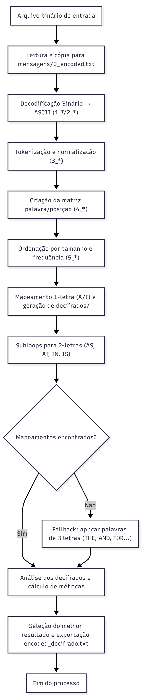

# 🧩 Aplicação de Método Heurístico para Decifração de Mensagens Utilizando Python

Este projeto implementa um **método heurístico de decifração automatizada** de mensagens codificadas em **binário ASCII**, inspirado em técnicas clássicas de **análise de frequência** e **mapeamento posicional de caracteres**.  
O sistema foi desenvolvido em **Python** e estruturado como um **pipeline modular**, permitindo acompanhar cada etapa da reconstrução do texto — desde a conversão do binário até a geração do conteúdo decifrado.

---

## 🧠 Objetivo

Demonstrar como **técnicas heurísticas**, baseadas em análise de frequência e padrões linguísticos da língua inglesa, podem ser aplicadas à **decifração automatizada de mensagens**.  
O método utiliza ocorrências comuns de palavras curtas (*A*, *I*, *IN*, *IS*, *THE*, *AND*, *FOR*, *NOT*) como ponto de partida para inferir substituições entre caracteres codificados e letras reais, refinando o mapeamento a cada iteração.

---

## ⚙️ Estrutura do Projeto

```
📦 projeto-decifracao
├── decrypt.py                         # Script principal (executa o pipeline completo)
├── funcoes_decodificador.py           # Módulo com todas as funções da heurística
├── top_words_banco_de_palavras.py     # Banco de palavras mais frequentes em inglês (base Norvig)
├── encoded_01.txt                     # Mensagem 1 (trecho da música Exist)
├── encoded_02.txt                     # Mensagem 2 (trecho de Pale Blue Dot)
├── fluxograma.svg                     # Diagrama do pipeline de decifração
│
├── mensagens/                         # Arquivos intermediários (tokens e matrizes)
├── mapeamentos/                       # Dicionários letra→letra gerados pelo processo
├── decifrados/                        # Arquivos com o texto decifrado em cada etapa
├── palavrasUsadas/                    # Registro das palavras aplicadas por subloop
│
└── README.md                          # Este arquivo
```

---

## 🧩 Funcionamento Geral

O pipeline executa as seguintes etapas principais:

1. **Leitura e Conversão:** converte a mensagem binária em texto ASCII.  
2. **Tokenização e Normalização:** separa tokens e os indexa por posição.  
3. **Ordenação:** organiza tokens por comprimento e frequência.  
4. **Mapeamento Heurístico:**  
   - Identifica palavras de **1 letra** (*A*, *I*);  
   - Testa combinações de **2 letras** (*AS*, *AT*, *IN*, *IS*);  
   - Aplica o *fallback* de **3 letras** (*THE*, *AND*, *FOR*, *NOT*) quando necessário.  
5. **Análise:** calcula métricas de progresso (% de texto traduzido e % de palavras reconhecidas).  
6. **Geração Final:** seleciona a melhor versão e gera o arquivo `encoded_decifrado.txt`.

O diagrama `fluxograma.svg` representa graficamente essas etapas.

---

## 🧰 Requisitos

- Python **3.8+**  
- Somente bibliotecas nativas (sem dependências externas)

---

## 🚀 Como Executar

1. **Clone o repositório:**
   ```bash
   git clone https://github.com/Marco-Mello/artigo_01.git
   cd artigo_01
   ```

2. **Escolha o arquivo de entrada:**
   - `encoded_01.txt` (trecho da música *Exist*)  
   - `encoded_02.txt` (trecho do discurso *Pale Blue Dot*)

3. **Execute o pipeline:**
   ```bash
   python decrypt.py
   ```

4. **Confira os resultados:**
   - Arquivos intermediários: `mensagens/`, `mapeamentos/`, `decifrados/`  
   - Texto final: `encoded_decifrado.txt`

---

## 📊 Métricas de Avaliação

O sistema avalia automaticamente cada etapa do processo, exibindo:

- **Percentual de palavras reconhecidas:** proporção de tokens válidos no banco de palavras.  
- **Percentual de texto traduzido:** relação entre letras substituídas e total de caracteres.  

Essas métricas permitem monitorar o progresso da decifração e comparar a eficácia entre execuções.

> Exemplo de saída (resumo por etapa) — formato gerado automaticamente pelo pipeline:
>
> ```
> ===== Etapa 1 (palavras de 1 letra) =====
> A_decifrado.py                      | Qtd. encontradas:   2.50% | Texto traduzido:   8.78%
> I_decifrado.py                      | Qtd. encontradas:   2.50% | Texto traduzido:   8.78%
>
> ===== Etapa 3 (palavras de 3 letras) =====
> THE_step1_decifrado.py              | Qtd. encontradas:  36.25% | Texto traduzido:  88.56%
> AND_step1_decifrado.py              | Qtd. encontradas:  11.25% | Texto traduzido:  54.79%
> ...
> → Arquivo com maior progresso: THE_decifrado.py
> ```

---

## 🧩 Resultados Obtidos

Foram decifradas duas mensagens originais em inglês:

- **encoded_01.txt** → trecho da música *Exist* (Avenged Sevenfold)  
- **encoded_02.txt** → trecho do discurso *Pale Blue Dot* (Carl Sagan)

Resultados resumidos:
- Aplicando o banco de palavras de **Peter Norvig** obtiveram-se traduções na faixa de **≈88,6 %** (encoded_01) e **≈95,4 %** (encoded_02).  
- Após ajuste (expansão controlada do banco com palavras relacionadas aos textos identificados), os percentuais chegaram a **≈98,4 %** (encoded_01) e **100,0 %** (encoded_02).  

> Observação: as palavras adicionadas para expansão foram escolhidas com base na análise dos decifrados preliminares e na comparação com possíveis textos originais encontrados em pesquisa na internet — procedimento consistente com o fluxo experimental descrito no artigo. Os ganhos foram reais, porém modestos em alguns casos (ou seja, houve melhoria, mas nem sempre grande impacto na percepção geral da qualidade do decifrado).

---

## ♟️ Observações sobre Reprodutibilidade e Uso

- O pipeline salva todos os mapeamentos e versões intermediárias, permitindo inspecionar e reproduzir qualquer estágio.  
- A estratégia de expansão do banco de palavras deve ser aplicada com cuidado: inserir termos conhecidos do provável texto facilita a recuperação, mas reduz a “pureza” de uma avaliação cega do método. No artigo essa escolha é explicitada como etapa experimental controlada.

---

## 🧠 Referências Teóricas

- M. Tyldum — *O Jogo da Imitação* (2014).  
- E. A. Poe — *O Escaravelho de Ouro* (1843).  
- P. Norvig — *English Letter Frequency Counts: Mayzner Revisited* (2012).  
- L. Possani — *Criptografia: das origens à obra de Edgar Allan Poe* (YouTube, 2025).  
- English Experts — *As palavras mais comuns da língua inglesa*.  
- Avenged Sevenfold — *Exist*, álbum *The Stage* (2016).  
- C. Sagan — *Pale Blue Dot: A Vision of the Human Future in Space* (1994).

---

## 🖼️ Fluxograma do Pipeline
<div style="text-align: center;">
   
</div>
---

## 👨‍💻 Autor

**Marco Mello**  
Programa de Pós-Graduação em Ciência da Computação — UFABC  
📧 marcomello.e@gmail.com

---


